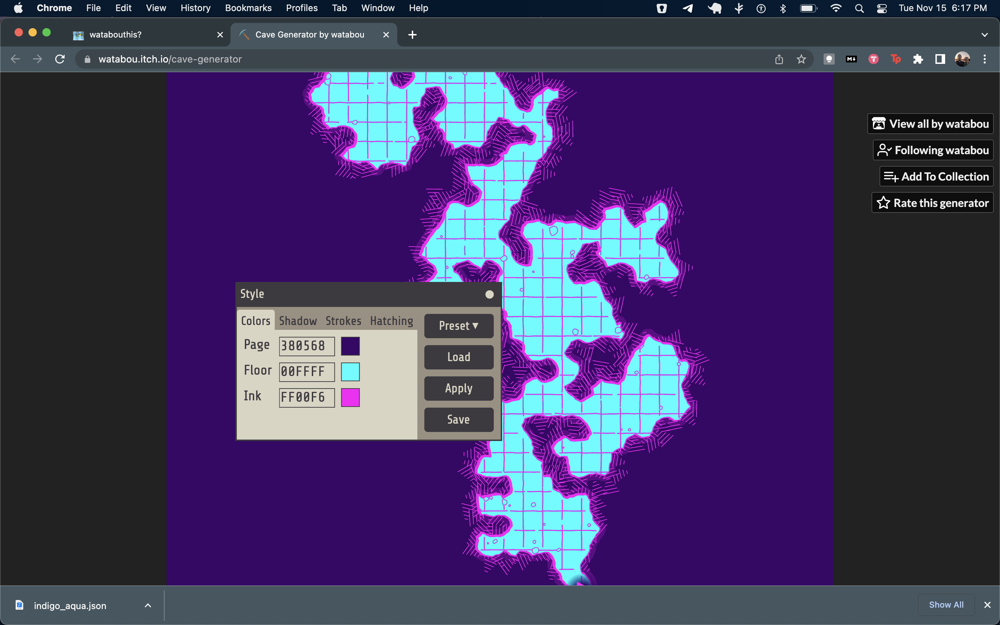
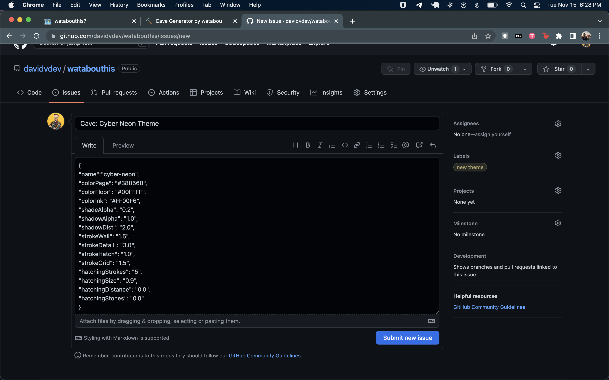

# WATABOUTHIS? 
## An unofficial styles repository for Watabou's generators
---
This single page application was created with the intent of facilitating the sharing of themes for Watabou's incredible generators. 

[Most of Watabou's generators can be found on their Procgen Arcana site.](https://watabou.github.io/index.html)

[There are additional Watabou generator's on their itch.io page, as well](https://watabou.itch.io/).

If there are any generator's missing that you would like to see supported, please add an issue with the `enhancement` label. 

Since this is a passion project, there may be delays to updating default themes as generator updates roll out, but I will do my best to stay on top of it.

## Contributing Themes
First things first, be sure to save your theme from the generator. You should end up with a JSON file.

There are two ways to contribute themes. 
1. If you're familiar with Github, JSON, and pull requests, feel free to fork this repo, add your new style (with a name!) to the JSON, and submit a pull request.
2. Otherwise feel free to open an issue with the raw text of your theme.
   - Please select the `new theme` label for your issue.
   - Include the name of the generator and theme in your title like `Cave: Cyber Neon`

Once your Pull Request or Issue has been reviewed, your theme will be available on the site for others to download.
